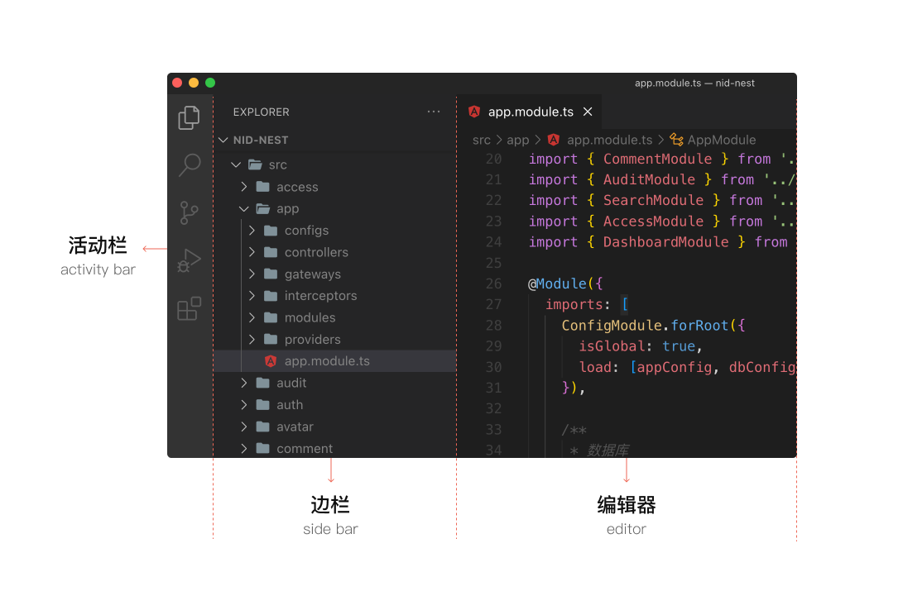
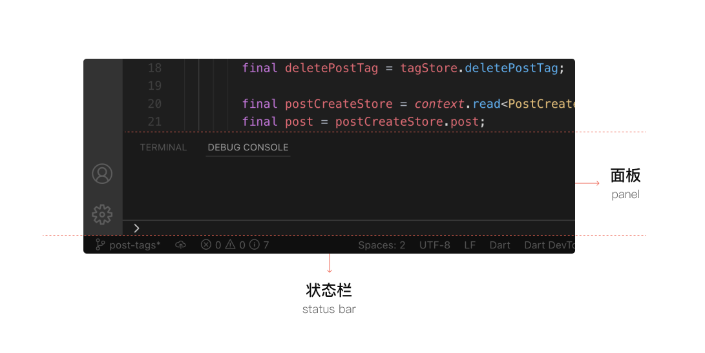

# VS Code-01: Intro

-   <https://ninghao.co/docs/tools/vscode/>

## 1. What Is VS Code?

**Visual Studio Code (VS Code)** is a **free, lightweight, and powerful code editor** developed by Microsoft.

It is widely used for:

-   Programming (Python, C/C++, Java, JavaScript, etc.)
-   Writing scripts and configuration files
-   Editing Markdown and documentation
-   Remote development (SSH, containers)

**Why beginners like VS Code**

-   Simple interface
-   Works on macOS, Windows, Linux
-   Huge extension ecosystem
-   Excellent keyboard shortcuts

------

## 2. Installing VS Code

### macOS / Windows / Linux

1.  Go to the official website
    👉 [https://code.visualstudio.com](https://code.visualstudio.com/)
2.  Download the installer for your OS
3.  Install it like any normal app

After installation, open **Visual Studio Code**.

------

## 3. First Look: VS Code Interface





When VS Code opens, you’ll see several main areas:

### ① Activity Bar (left side)

Icons for:

-   **Explorer** 📁 (files)
-   **Search**
-   **Source Control (Git)**
-   **Run & Debug**
-   **Extensions**

### ② Side Bar

Shows files, search results, extensions, etc.

### ③ Editor Area (center)

Where you **edit files**

### ④ Status Bar (bottom)

Shows:

-   Language mode (e.g. Python, C, Plain Text)
-   Encoding
-   Line/column number

------

## 4. Opening a Folder (Very Important)

VS Code works best when you open a **project folder**, not just a single file.

### Open a folder

-   Menu → **File → Open Folder**
-   Or drag a folder into VS Code

📌 Once opened, all files appear in the **Explorer**.

------

## 5. Creating and Editing Files

### Create a new file

-   Explorer → Click **New File**
-   Or press:

```text
Ctrl + N   (Windows / Linux)
Cmd  + N   (macOS)
```

### Save a file

```text
Ctrl + S   (Windows / Linux)
Cmd  + S   (macOS)
```

### File extension matters

-   `main.c` → C language
-   `test.py` → Python
-   `README.md` → Markdown

VS Code automatically detects the language.

------

## 6. Command Palette (Most Important Feature)

The **Command Palette** lets you control almost everything.

Open it with:

```text
Ctrl + Shift + P   (Windows / Linux)
Cmd  + Shift + P   (macOS)
```

Examples:

-   `Preferences: Open Settings`
-   `Python: Select Interpreter`
-   `Format Document`

📌 If you forget how to do something, **use the Command Palette**.

------

## 7. Extensions (Superpowers of VS Code)

Extensions add language support, themes, debuggers, and tools.

### Open Extensions Panel

-   Click the **Extensions icon** 🧩
-   Or:

```text
Ctrl + Shift + X
```

### Recommended extensions for beginners

#### Programming

-   **Python** (Microsoft)
-   **C/C++** (Microsoft)
-   **Java Extension Pack**
-   **Code Runner** (run code quickly)

#### General

-   **GitLens** (Git helper)
-   **Prettier** (code formatter)
-   **Markdown All in One**

Click **Install**, reload if needed.

------

## 8. Integrated Terminal

VS Code has a built-in terminal.

### Open terminal

```text
Ctrl + `
```

(backtick key)

You can:

-   Run Python / C / shell commands
-   Use git
-   Use the same terminal as your OS

Example:

```bash
python main.py
gcc main.c -o main
./main
```

------

## 9. Basic Editing Shortcuts (Must Know)

| Action            | Shortcut                      |
| ----------------- | ----------------------------- |
| Copy line         | `Ctrl/Cmd + C` (no selection) |
| Cut line          | `Ctrl/Cmd + X`                |
| Move line up/down | `Alt + ↑ / ↓`                 |
| Duplicate line    | `Shift + Alt + ↓`             |
| Comment line      | `Ctrl/Cmd + /`                |
| Find              | `Ctrl/Cmd + F`                |
| Replace           | `Ctrl/Cmd + H`                |

------

## 10. Formatting Code Automatically

### Format current file

```text
Shift + Alt + F   (Windows / Linux)
Shift + Option + F   (macOS)
```

You may need:

-   **Prettier** (for JS/HTML/Markdown)
-   **Python formatter** (black, autopep8)

------

## 11. Settings (Beginner Friendly)

Open settings:

```text
Ctrl + ,   (Windows / Linux)
Cmd  + ,   (macOS)
```

You can:

-   Change font size
-   Enable autosave
-   Choose color theme

### Example useful settings

-   `Editor: Font Size`
-   `Files: Auto Save → afterDelay`
-   `Editor: Format On Save`

------

## 12. Themes (Make It Comfortable)

### Change theme

```text
Ctrl/Cmd + Shift + P
→ Color Theme
```

Popular themes:

-   Dark+ (default)
-   One Dark Pro
-   GitHub Theme

------

## 13. Running Code (Simple Way)

### Option 1: Terminal

Manually run:

```bash
python file.py
```

### Option 2: Code Runner Extension

-   Right-click in editor
-   Click **Run Code**

Good for beginners 👍

------

## 14. Git Basics in VS Code (Optional)

If you use Git:

-   Click **Source Control** icon
-   Stage files
-   Commit
-   Push / Pull

VS Code integrates Git visually—no commands required at first.

------

## 15. Recommended Beginner Workflow

1.  Open a project folder
2.  Create/edit files
3.  Use extensions for your language
4.  Run code in terminal
5.  Format code regularly
6.  Use Command Palette when stuck

------

## 16. Common Beginner Mistakes

❌ Editing files without opening a folder
❌ Not installing language extensions
❌ Ignoring error messages
❌ Not using the terminal
❌ Not saving files

------

## 17. When You’re Ready for More

Next steps:

-   Debugging
-   Remote SSH development
-   Docker support
-   Custom keybindings
-   Workspace settings

------

### Final Tip 💡

>   VS Code looks simple, but it grows with you.
>   Start small, learn shortcuts gradually, and **use the Command Palette often**.