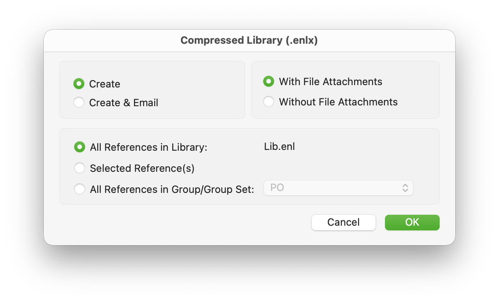

## 1. What EndNote actually is (and what it is not)

**EndNote is a reference manager**, not a PDF reader and not a word processor.

Its core jobs are:

-   Store **bibliographic records** (author, title, journal, year, DOI, etc.)
-   Attach and manage **PDF files**
-   Insert **citations** into Word
-   Automatically generate **reference lists** in a required style (APA, IEEE, Chicago…)

Think of EndNote as a **database + file manager** for academic papers.

## 2. Mental model: how EndNote stores things on disk

This part is critical and often misunderstood.

### An EndNote “library” is NOT a single file

When you create a library called:

```
MyResearch.enl
```

EndNote actually creates **two things** in the filesystem:

```
MyResearch.enl
MyResearch.Data/
```

### What each part does

| Item               | Purpose                                         |
| ------------------ | ----------------------------------------------- |
| `MyResearch.enl`   | The **database index** (metadata, links, notes) |
| `MyResearch.Data/` | All **attachments, PDFs, figures, cache files** |

💡 **Rule #1:**

>   The `.enl` file and `.Data` folder **must always stay together**.

If you move, rename, or delete only one of them, the library breaks.

## 3. Where you should store your EndNote library

### Best practice locations

-   A dedicated folder like:

    ```
    Documents/
      EndNote/
        MyResearch.enl
        MyResearch.Data/
    ```

-   Or a synced folder **only if syncing is safe** (more on this later)

### Locations to avoid

❌ Desktop (easy to accidentally delete)

❌ Temporary folders

❌ USB drives (unless read-only use)

❌ Directly inside cloud-sync folders (Dropbox, iCloud) **without precautions**

## 4. How EndNote manages PDF files

### Option A: PDFs attached to references (recommended)

When you:

-   Import a paper
-   Or drag a PDF into EndNote

EndNote will:

1.  Copy the PDF

2.  Store it inside:

    ```
    MyResearch.Data/PDF/
    ```

3.  Link it to the reference record

You **do not** need to remember where the PDF is stored.

### Option B: Linking to external PDFs (advanced, not recommended for beginners)

EndNote can link to PDFs stored elsewhere, but:

-   Moving the file breaks the link
-   Cloud syncing becomes risky

For beginners: **don’t do this**.

## 5. Automatic PDF organization (very important setting)

Go to:

```
EndNote → Settings → PDF Handling
```

Enable:

-   ✅ Automatically rename PDF files
-   ✅ Automatically import PDFs

Typical rename format:

```
Author + Year + Title.pdf
```

Example:

```
Smith_2022_Neural_Networks.pdf
```

This gives you:

-   Clean filenames
-   Consistent organization
-   Easier recovery if something breaks

## 6. How EndNote imports references (filesystem view)

### Method 1: Direct export from databases

From sources like:

-   Google Scholar
-   Web of Science
-   PubMed
-   IEEE Xplore

You usually download a file like:

```
citation.enw
```

When opened:

-   EndNote reads metadata
-   Creates a new record
-   Optionally downloads PDFs

Filesystem-wise:

-   Metadata goes into `.enl`
-   PDFs go into `.Data/PDF/`

### Method 2: Drag & drop PDFs

You can drag a PDF into EndNote.

EndNote will:

1.  Try to extract metadata (title, author, DOI)
2.  Create a reference automatically

If metadata fails:

-   You can edit it manually later

## 7. Groups ≠ folders (common beginner confusion)

### Groups are NOT filesystem folders

In EndNote:

-   **Groups** are like *tags or playlists*
-   A reference can appear in multiple groups
-   Deleting a group does **not** delete the reference

On disk:

-   Nothing changes
-   Files remain in `.Data/`

Think:

>   Groups = logical organization
>
>   Filesystem = physical storage

## 8. Safe backup strategies (do this early)

### The correct way to back up an EndNote library

Use:

```
File → Compressed Library (.enlx)...
```



This creates **one file**:

```
MyResearch.enlx
```

Which contains:

-   `.enl`
-   `.Data/`
-   All PDFs

This is the **only safe way** to:

-   Move libraries
-   Send them to others
-   Store backups

### Backup frequency

-   Weekly minimum
-   Before major edits
-   Before OS upgrades

## 9. EndNote + cloud storage (Dropbox, iCloud, OneDrive)

### The danger

Cloud tools:

-   Sync file-by-file
-   EndNote expects atomic database operations

This can cause:

-   Corrupted libraries
-   Missing PDFs
-   Broken indexes

### Safe approaches

✅ **Best**:

-   Store library locally
-   Sync only `.enlx` backups

✅ **Acceptable** (advanced users):

-   Use EndNote Online sync
-   Or ensure EndNote is closed before cloud sync

❌ **Unsafe**:

-   Actively opening `.enl` inside a syncing folder

## 10. Using EndNote with Word

When you insert citations:

-   EndNote does **not** copy PDFs into Word
-   Word stores citation placeholders
-   Formatting happens dynamically

Your Word file depends on:

-   The EndNote library being available
-   Matching record IDs

💡 If you send a Word file to someone:

-   Also send the `.enlx` library

## 11. Common beginner mistakes (and how to avoid them)

| Mistake                              | Fix                          |
| ------------------------------------ | ---------------------------- |
| Moving only `.enl`                   | Always move `.enl` + `.Data` |
| Storing library on Desktop           | Use Documents folder         |
| Cloud sync corruption                | Use `.enlx` backups          |
| Renaming PDFs manually               | Let EndNote manage PDFs      |
| Using Finder/Explorer to clean files | Never touch `.Data` manually |

## 12. A simple, recommended workflow

1.  Create one main library per project
2.  Store it locally
3.  Import references from databases
4.  Let EndNote manage PDFs
5.  Organize with Groups
6.  Back up weekly as `.enlx`
7.  Insert citations only via Word plugin

## 13. Final takeaway

If you remember only three things, remember these:

1.  **`.enl` and `.Data` are inseparable**
2.  **Never manually edit EndNote’s internal folders**
3.  **Backups should be `.enlx`, not raw files**

